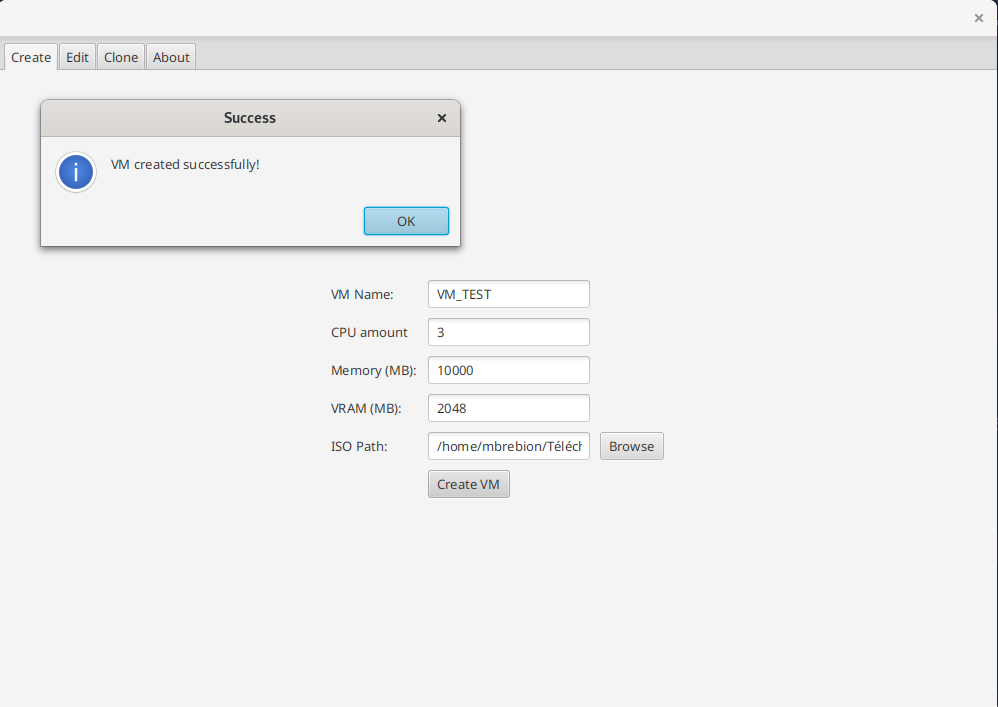
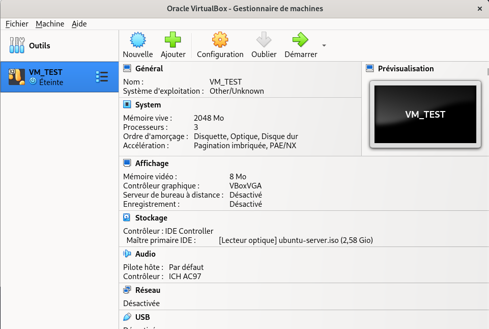
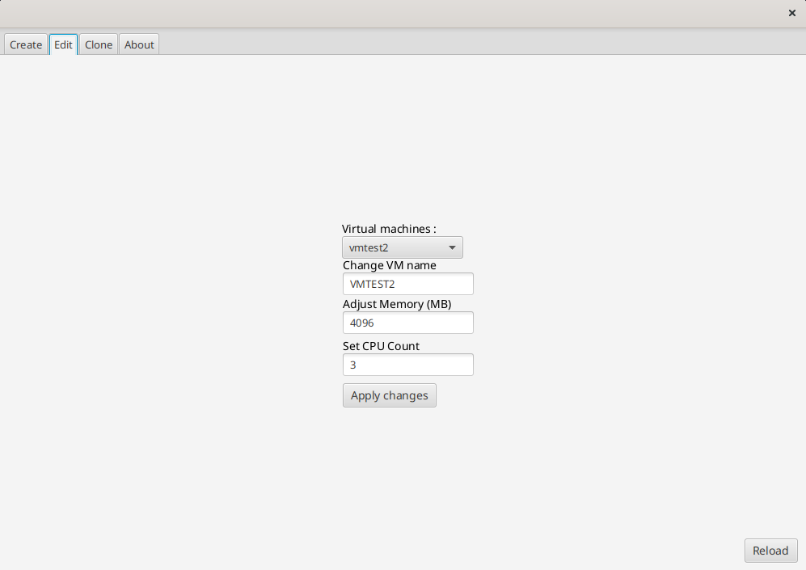
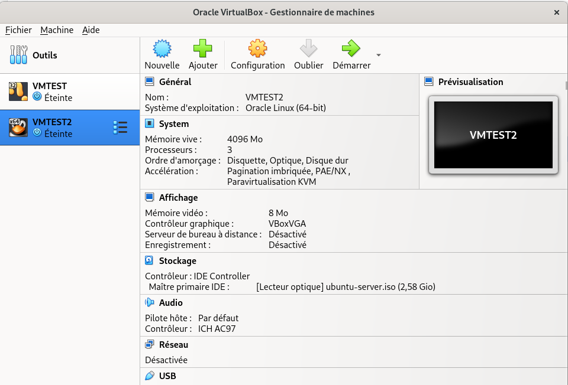
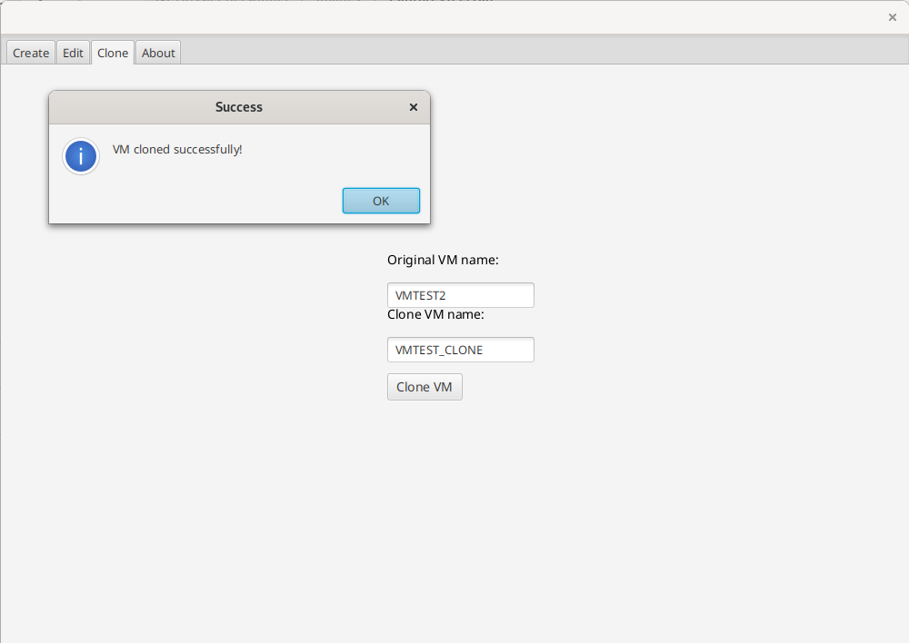
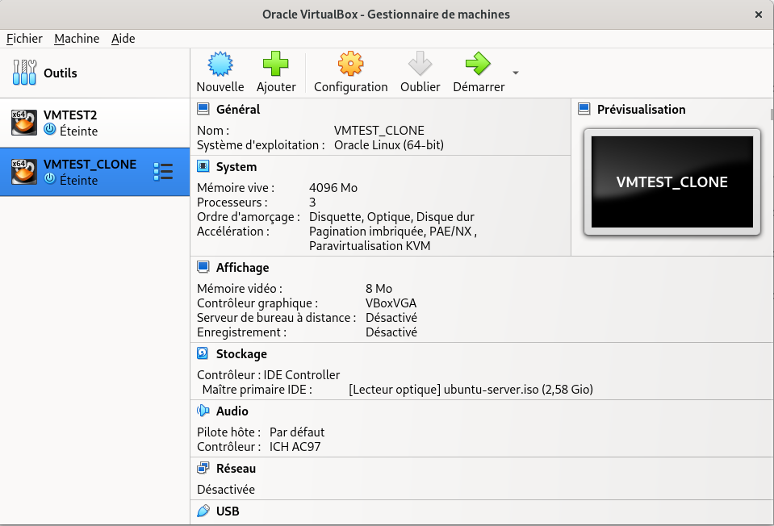

# virtualbox-wrapper

## Description

> Petit projet JavaFX pour gérer des machines virtuelles avec les lignes de commande de VirtualBox.

## Installation

Avant de pouvoir utiliser ce wrapper, il est nécessaire d'ajouter VirtualBoxManager aux variables d'environnement.

### Configuration

1. **Prerequisites**: OpenJDK (21 ou ultérieur)

2. **Setup de VirtualBox**: Ajouter comme chemin par défaut de stockage des machines virtuelles: `user-path/VirtualBox-VMs`. Remplacer _user-path_ par le chemin vers le répertoire de votre utilisateur.

### Comment déboguer l'application ?

Aucun déploiement n'a encore été réalisé.
Afin d'être en mesure de déboguer l'application vous pouvez cloner le repository et exécuter le fichier racine `App.java`.

Un script **maven** permettant de packager l'application est également disponible, le fichier `jar` alors généré sera alors contenu dans le dossier `target`.

## Aperçu de l'application

Création des VM:

Édition des VMs:

Clonage des VMs:

